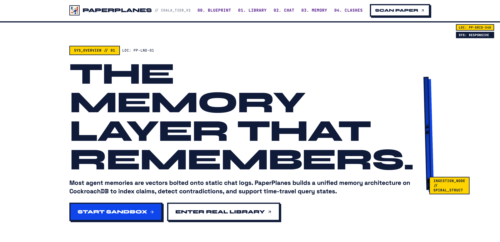
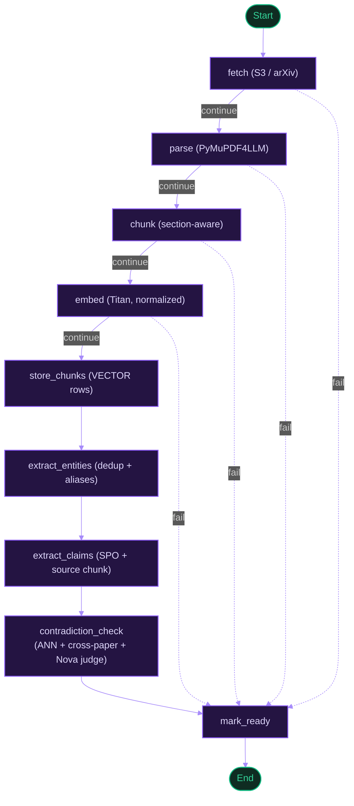
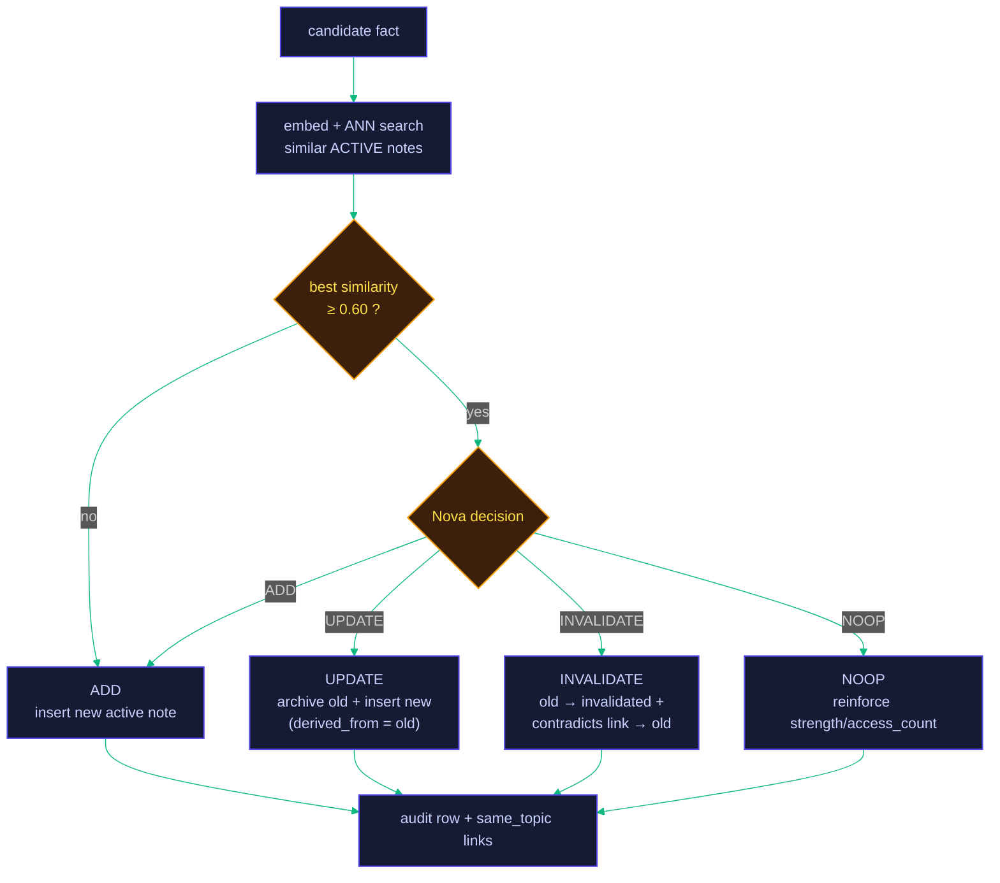

<p align="center"></p>

<h1 align="center">PaperPlanes</h1>

<p align="center"><strong>A research companion whose memory <em>is</em> the product — built on CockroachDB.</strong></p>

<p align="center">
  Feed it papers (PDF or arXiv). It reads them, extracts entities and claims, links ideas
  across papers, tracks your open questions across sessions, and holds two papers in tension
  when they disagree — all on a memory substrate that a flat file <em>provably</em> cannot replace.
</p>

<p align="center">
  
  
  
  
  
</p>

<p align="center">
  
  
  
  
  
</p>

<p align="center">
  Built for the <a href="https://cockroachdb-ai.devpost.com/">CockroachDB × AWS “Build with Agentic Memory” hackathon</a>.
</p>

<p align="center">
  
</p>

---

## Proof, not adjectives

Every claim below is reproduced by a script or test in this repo — not asserted.

- **0 writes lost under contention.** 25 concurrent writers incrementing one counter: a flat-file / in-memory dict analog kept only **1 / 25**; CockroachDB kept **25 / 25**, with **58 SERIALIZABLE conflicts detected and auto-retried to success**. → `app.scripts.demo_concurrency`
- **ANN stays index-served at scale.** Over **~10,000** memory notes, `EXPLAIN ANALYZE` resolves the retrieval query with a **C-SPANN `vector search`** on `notes_embedding_idx` (**~15 ms** step) — never a full scan. → `app.scripts.seed_scale --explain`
- **Survives a crash mid-conversation.** After a live CockroachDB restart mid-session, the next chat turn returns **`200`** (was `500` before the resilience fix) — checkpointed history intact. → `scripts/demo_restart_durability.sh`
- **Real papers, real pipeline.** 4 arXiv papers ingested end-to-end yielded **424 extracted claims** (NCF 96 · Dacrema 178 · RHN 89 · Melis 61) through parse → embed → claim-extraction → contradiction-check.
- **171 tests — and the ones that matter inspect real rows.** **10 / 10** live integration tests assert on the actual `memory_notes` / `claims` / `contradictions` / `reflections` rows CockroachDB holds (real Bedrock, real SQL, no mocks), and the memory-eval suite passes **4 / 4** probes.

---

## Core Philosophy

* **Memory is the product, not a bolt-on vector store.** PaperPlanes uses CockroachDB as a real transactional memory substrate — bi-temporal versioning, SERIALIZABLE writes, vector ANN, graph traversal, and agent self-introspection over MCP — synthesized from six memory papers into one cluster.
* **Invalidate, don't delete.** Contradicted knowledge is versioned out with `invalid_at`/`expired_at`, never removed. You can query *what the agent believed at time T* (`as_of`) and watch it change its mind in the audit log.
* **Hold the tension.** When two papers disagree, both claims stay `disputed` — neither wins by default. Memory that surfaces a conflict is doing something analytical, not just retrieving.
* **Proven, not asserted.** Every core mechanism has a live end-to-end test that inspects the *actual rows CockroachDB holds* — not a mock, not a `200 OK`. See [Proven behavior](#proven-behavior-real-logic-real-rows).

---

## Why memory is the product

Most "AI memory" is a vector store bolted onto a chatbot. PaperPlanes implements a unified memory architecture drawn from the literature:

| Mechanism | Source | What it does here |
|---|---|---|
| Bi-temporal facts (`valid_at`/`invalid_at` + txn time) | **Zep** | Contradicted knowledge is invalidated, never deleted — point-in-time (`as_of`) queries + full audit history |
| ADD / UPDATE / INVALIDATE / NOOP write path | **Mem0** | New facts are consolidated against existing memory, not blindly appended |
| Linked memory notes | **A-MEM** | Notes carry keywords/tags/context and LLM-refined `same_topic`/`contradicts` links |
| recency × importance × relevance retrieval, Ebbinghaus decay | **Generative Agents / MemoryBank** | Memories strengthen when accessed, fade when neglected |
| Async reflection ("sleep-time compute") | **Letta** | Background worker distills episodic memory into cited insights |
| Working / episodic / semantic / procedural tiers | **CoALA** | All four tiers live in one CockroachDB cluster |

---

## Stack

- **Memory layer** — CockroachDB Cloud: distributed **vector indexes** (C-SPANN, `VECTOR(1024)`), **Managed MCP Server** (agent self-introspection over read-only SQL), LangGraph checkpoints via `langchain-cockroachdb`, bi-temporal schema, recursive-CTE graph traversal.
- **Agents** — LangGraph + FastAPI (Python 3.12). Amazon **Nova Pro** (chat + claim extraction), **Nova Lite** (fast decision/judge), **Titan Text Embeddings V2** (1024-dim) — all via **Amazon Bedrock**.
- **AWS** — Bedrock, S3 (PDF storage), EC2 (deployment).
- **Frontend** — React 19 + Vite: Chat, Library, **Memory Inspector** (timeline / diff / graph), Contradictions.

> Nova is a config swap (`BEDROCK_CHAT_MODEL_ID` / `BEDROCK_FAST_MODEL_ID`). Amazon's first-party models bill through standard AWS consumption; Anthropic Claude on this account routes through Bedrock Marketplace (card-gated), so Nova is the default.

---

## Graph Topology

Two compiled LangGraph pipelines drive everything. Both **self-degrade** node-by-node (no AWS creds, no retrievable context, an unreachable DB) rather than branching between "real" and "echo" graphs — one compiled graph covers CI through full production.

### 1. Chat Graph — retrieve → reason → consolidate

The user only ever waits on `agent`. Everything after it (`write_episodes → extract_facts → memory_write`) records the turn and consolidates new facts *after* the reply is already produced.

```mermaid
%%{init: {'theme':'dark','themeVariables':{'background':'#0b0f19','primaryColor':'#1e293b','primaryTextColor':'#f8fafc','lineColor':'#38bdf8','nodeBorder':'#334155'}}}%%
flowchart LR
    Start([Start]) --> LC["load_context<br/>(session + user)"]
    LC --> RET["retrieve<br/>(ANN + Ebbinghaus rescore<br/>+ reinforce strength)"]
    RET --> AC["assemble_context<br/>(token budget + citations)"]
    AC --> AG["agent<br/>(Nova Pro + tools:<br/>search_memory, contradictions,<br/>memory_introspect [MCP])"]
    AG --> WE["write_episodes"]
    WE --> EF["extract_facts<br/>(Nova)"]
    EF --> MW["memory_write<br/>(Mem0 consolidate)"]
    MW --> End([End])

    classDef n fill:#161b33,stroke:#4f46e5,stroke-width:1.5px,color:#c7d2fe;
    classDef se fill:#0f2c22,stroke:#10b981,stroke-width:1.5px,color:#34d399;
    class LC,RET,AC,AG,WE,EF,MW n;
    class Start,End se;
```



### 2. Ingestion Graph — PDF → claims → contradictions

Every pre-storage step routes through a `continue / fail` guard that short-circuits to `mark_ready` (writing `status='failed'`). The extraction trio self-degrades instead, so a paper always reaches a terminal state.



### 3. Mem0 Write Path — the decision that makes memory ≠ append-log

For each candidate fact: embed, ANN-search similar active notes, and if anything is close enough, ask Nova to choose exactly one of four branches. The decision always happens *before* any row mutation — no transaction is held open across an LLM call.



---

## The code that does the work

Four modules carry the memory engine. Each is small, pure where it can be, and does exactly one thing — the snippets below are the load-bearing lines (long names trimmed for width).

<table>
<tr><td width="50%" valign="top">

**`memory/writer.py`** — *makes memory ≠ append-log*

The cheap common case skips the LLM entirely; the decision always runs **before** any row mutation, so no transaction is ever held open across a model call.

```python
best = cos(similar[0]) if similar else -1.0
if not similar or best < ADD_SIMILARITY_THRESHOLD:
    return await self._apply_add(...)   # new → skip LLM

decision = await self._decide(candidate, similar)
# → ADD / UPDATE / INVALIDATE / NOOP
```

Nova sometimes hands back a `note_id` we never offered. We snap it back to a real candidate instead of trusting it:

```python
valid_ids = {n["id"] for n in similar}
target_id = (decision.note_id
             if decision.note_id in valid_ids else None)
```

</td><td width="50%" valign="top">

**`memory/scoring.py`** — *pure, no I/O, fully unit-tested*

The forgetting curve and spaced-repetition reinforcement — no DB, no model, so every branch is testable in isolation.

```python
def ebbinghaus_retention(dt, S):     # R = e^(−Δt/S)
    if S <= 0:  return 0.0
    if dt <= 0: return 1.0
    return math.exp(-dt / S)

def reinforce(S, access_count):      # S·(1 + 1/(n+1))
    return S * (1 + 1 / (access_count + 1))
    # 1st access ~doubles S, then diminishing
```

One choke point converts an ANN distance to similarity, so `writer` (dedup) and `retriever` (relevance) always agree:

```python
def l2_to_cosine(d):     # unit vecs: ‖a−b‖²=2−2·cos
    return clamp(1.0 - d * d / 2.0, -1.0, 1.0)
```

</td></tr>
<tr><td width="50%" valign="top">

**`memory/db/retry.py`** — *why 25/25 writers survive*

CockroachDB aborts contended `SERIALIZABLE` txns with `SQLSTATE 40001`. Every write path wraps its transaction here — retried with exponential backoff + full jitter, only on that error class.

```python
for attempt in range(max_attempts):
    try:
        return fn()
    except Exception as exc:
        if not _is_retryable(exc):   # only 40001
            raise
        sleep(random.uniform(
            0, min(max_delay, base_delay * 2**attempt)))
```

</td><td width="50%" valign="top">

**`memory/db/notes_repo.py`** — *bi-temporal `as_of`*

`list_notes(as_of=T)` reconstructs transaction-time state as it stood at any instant `T` — the query that lets you ask *"what did the agent believe then?"*

```sql
WHERE created_at <= :as_of
  AND (expired_at IS NULL OR expired_at > :as_of)
ORDER BY valid_at DESC
```

Nothing is deleted — a superseded note keeps its row with `expired_at` stamped, so history stays queryable forever.

</td></tr>
</table>

---

## Could you just use a flat file?

The single sharpest question for an "agentic memory" project. PaperPlanes answers it with reproducible tests, not adjectives. **No — and here is the measured proof.**

| Property | Flat file / in-memory dict | CockroachDB (PaperPlanes) | How it's proven |
| :--- | :--- | :--- | :--- |
| **25 concurrent writers, 1 counter** | **1 / 25** survive — 24 updates silently lost | **25 / 25** survive — 58 serialization conflicts detected & retried | `app.scripts.demo_concurrency` (SERIALIZABLE + `run_transaction`) |
| **ANN over ~10⁴ memory notes** | O(n) full scan | **C-SPANN vector index** — `EXPLAIN` shows `vector search` on `notes_embedding_idx` (~15 ms step), not `full scan` | `app.scripts.seed_scale --explain` |
| **Crash mid-conversation** | history gone | reply returns **`200`** on the next turn after a live DB restart (was `500` pre-fix) | `scripts/demo_restart_durability.sh` |
| **"What did you believe at time T?"** | unanswerable | `as_of` reconstructs the superseded value from `created_at`/`expired_at` | live integration suite |
| **Multi-user isolation** | manual | real `users` rows + `user_id`-scoped vector index prefix | live integration suite |

---

## Proven behavior (real logic, real rows)

`backend/tests/integration/test_core_features_live.py` runs **10 tests against a live CockroachDB + real Bedrock** (Titan + Nova), each under an isolated throwaway user, each asserting on the *actual rows* written. Not mocked, not stubbed, not a `200`-check.

| Feature | What the test forces (real data in) | What CockroachDB actually contains after |
| :--- | :--- | :--- |
| **Mem0 ADD** | brand-new fact, no similar note | 1 `active` `VECTOR(1024)` row + `add` audit |
| **Mem0 NOOP** | identical duplicate | **no new row**; `strength 1.0 → 2.0`, `access_count 0 → 1` |
| **Mem0 UPDATE** | "10,000 examples" → "50,000" | old `archived` + `expired_at`; new active carries `derived_from = [old]` |
| **Mem0 INVALIDATE** | "90% acc" → "55%, 90% was wrong" | old `invalidated` + `invalid_at`; real `contradicts` link new → old |
| **Mem0 decision (real Nova)** | 72% → 26% contradiction, no injection | Nova genuinely returns a branch; every non-active row correctly time-stamped |
| **Bi-temporal `as_of`** | write, wait, supersede | `as_of=before` → old value; `as_of=now` → new value; old row retained |
| **Contradiction detection** | two real papers' verbatim same-subject claims | `contradictions` row + **both claims `disputed`** (both retained) + rationale |
| **Reflection worker** | 5 real notes, manual trigger | 3 reflections; **every persisted citation resolves to a real input note** (hallucinated ids dropped) |
| **Decay pass** | an aged, low-strength note | retention `0.0 < 0.05` → note `archived` + `archive` audit |
| **Scoring / decay** | 2 real retrievals of one note | `strength 1.0 → 2.0 → 3.0` **persisted** to the DB, 2 `read` audit rows |

Plus: `tests/eval/` memory probes pass **4 / 4** (knowledge-update, temporal point-in-time, cross-session decision-driving, abstention), and the unit suite covers scoring math, the writer's four branches, retry logic, and auth.

<details>
<summary><strong>View a live test execution stream</strong></summary>

```ansi
1b. Mem0 NOOP — duplicate fact reinforces the existing note (real rows)
  seeded note: {'strength': 1.0, 'access_count': 0}
  writer result: [{'action': 'noop', ...}]
  DB AFTER -> note count: 1 (no new row inserted)
  DB AFTER -> strength: 1.0 -> 2.0 | access_count: 0 -> 1

1d. Mem0 INVALIDATE — old note invalidated + contradicts link written
  DB AFTER -> old note status: invalidated | invalid_at set: True
  DB AFTER -> contradicts link: contradicts  new -> old

2. Bi-temporal as_of — old value retrievable at old time, gone at new time
  as_of=...:35 (BEFORE supersession) -> ['Paper Y ... converges in 100 iterations.']
  as_of=...:37 (NOW)                  -> ["Paper Y's method ... requires 5,000 iterations."]

3. Contradiction detection — real, citable arXiv disagreement
  Paper B (1708.05031): Neural collaborative filtering substantially outperforms ... baselines.
  Paper A (1907.06902): Well-tuned baselines outperform ... neural collaborative filtering ...
  node returned contradictions: 1
  DB AFTER -> claim A status: disputed | claim B status: disputed

5. Scoring/decay — retrieval reinforces strength and PERSISTS it to the DB
  strength trajectory across accesses (read back from DB each time): [1.0, 2.0, 3.0]
```
</details>

---

## Contradiction detection — and its honest envelope

The ingestion pipeline extracts SPO claims per paper and, for each new claim, ANN-searches existing **cross-paper** active claims, judging near matches with Nova. On a `contradicts` verdict, **both** claims are flagged `disputed` (retained) and a `contradictions` row is written — resolution stays human-in-the-loop.

We stress-tested this on **real arXiv papers through the full pipeline** and report the result honestly:

- ✅ **Same-subject conflicting claims** → detected end-to-end (the standing-tension proof above).
- ⚠️ **Two independently-written papers that disagree *thematically*** → often *not* auto-detected. Measured: NCF (1708.05031, 96 claims) vs Dacrema (1907.06902, 178 claims) name different specific systems; RHN (1607.03474, 89 claims) vs Melis (1707.05589, 61 claims) share the subject (RHN perplexity on Penn Treebank) but their extracted phrasings land at cosine **0.49–0.52** — below the 0.60 candidate floor calibrated for near-paraphrase — so the judge is never invoked.

**Why it matters:** the detector reliably fires when two claims are near-paraphrase conflicts about the same subject. True open-corpus cross-paper detection needs a lower floor or **entity-based candidate matching** (canonical subject/object entities) rather than raw statement embeddings — a documented, scoped next step, not a hidden gap. The operating envelope is recorded in the contradiction test itself.

---

## Agentic self-introspection via CockroachDB MCP

The chat agent carries a `memory_introspect` tool wired to the **CockroachDB Managed MCP Server**. For meta-questions ("how many papers this month?", "what's my biggest memory table?") it composes read-only SQL against *its own memory*, executed through MCP with a service-account key scoped to `mcp:read` (the server rejects anything that isn't a `SELECT`). Every introspection is written to the `memory_audit_log`. Two required CockroachDB tools, used meaningfully: **distributed vector indexing** + **Managed MCP Server**.

---

## Quick start (local)

```bash
cp .env.example .env          # add AWS creds for real LLM calls; echo mode runs without them
docker compose up --build
docker compose exec backend python -m app.scripts.init_db
# open http://localhost/
```

Dev servers: `cd backend && uvicorn app.main:app --reload` · `cd frontend && npm run dev`

Reproduce the proofs:

```bash
cd backend
# the flat-file-can't-do-this benchmarks
DATABASE_URL="postgresql://root@localhost:26257/defaultdb?sslmode=disable" python -m app.scripts.demo_concurrency
DATABASE_URL="postgresql://root@localhost:26257/defaultdb?sslmode=disable" python -m app.scripts.seed_scale --explain
# the live, real-logic integration suite (needs live DB + AWS creds)
DATABASE_URL="postgresql://root@localhost:26257/defaultdb?sslmode=disable" \
  python -m pytest tests/integration/test_core_features_live.py -s -v
```

---

## Repository layout


```text
backend/            FastAPI + LangGraph — app/memory (engine), app/core (graphs/nodes/models),
                    app/api (routes), app/scripts (init_db, seeds, benchmarks), tests/{unit,integration,eval}
frontend/           React 19 + Vite (Swiss Brutalist UI) — Landing, Chat, Library,
                    Memory Inspector (timeline/diff/graph/time-travel), Contradictions
docs/               ARCHITECTURE · PRODUCTION (ECS path) · SECURITY (least-privilege IAM + API auth) · HACKATHON
docker-compose.yml  single-node CockroachDB v25.2 + backend + frontend
```


## Docs

- [`CONTRIBUTING.md`](CONTRIBUTING.md) — **start here** to learn the repo: which papers to read, the tech stack, and a follow-the-data reading order through the code
- `docs/ARCHITECTURE.md` — memory engine design
- `docs/PRODUCTION.md` — productionization path (ECS Fargate)
- `docs/SECURITY.md` — least-privilege IAM, secrets handling, API auth
- `docs/HACKATHON.md` — tool-usage write-up

## License

This project is licensed under the [MIT License](LICENSE-MIT).
